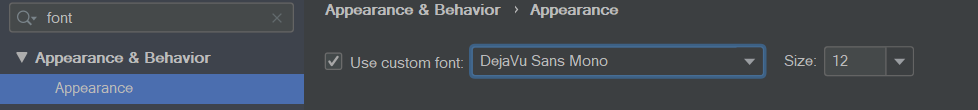
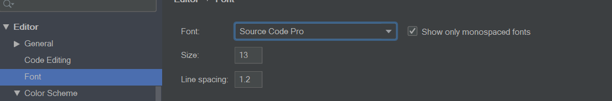
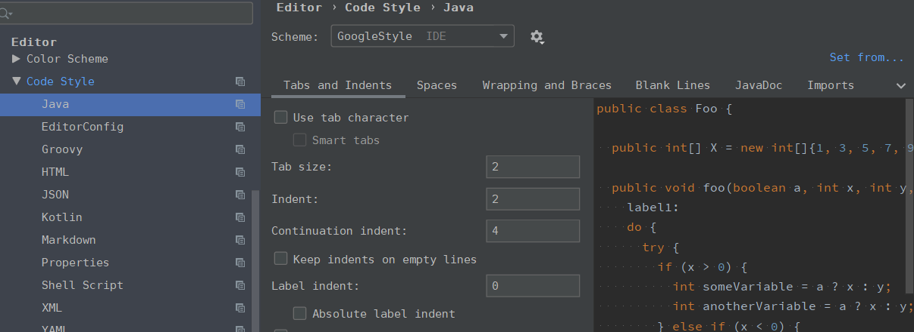
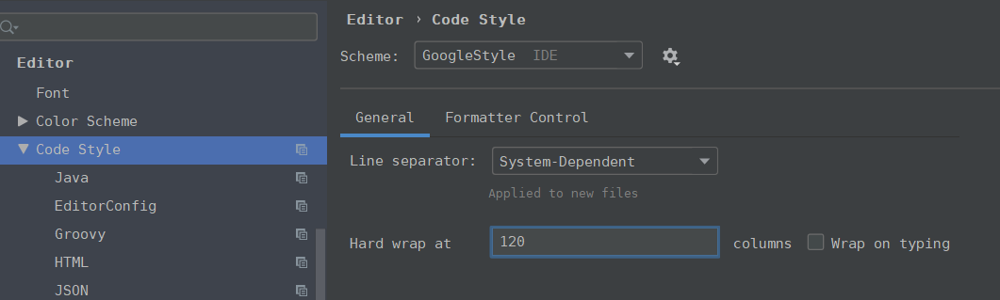
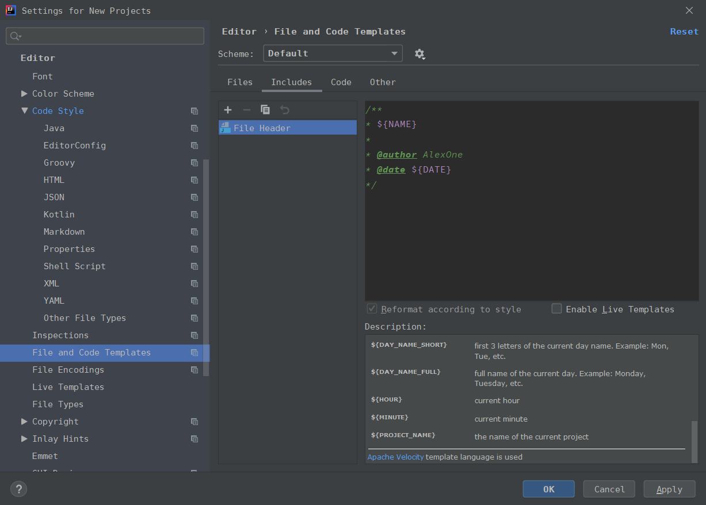

# 配置intellij

## 通用设置

1. 界面字体

   DejaVu Sans Mono

   

2. 主题

   [获取更多主题](http://www.riaway.com/theme.php)

3. 代码字体

   习惯使用 Source Code Pro

   

4. Code Style

   [intellij-java-google-style.xml](https://github.com/google/styleguide/blob/gh-pages/intellij-java-google-style.xml)

   

5. 换行

   一行长度设置为 120

   

6. File Header

   

## 插件

### 常用

- Alibaba Java Coding Guidelines： 编程规范

- Grep Console： 区分日志颜色

- Translation： 翻译

- CodeGlance： 代码滚动条

- Lombok： 简化代码

###  未使用

- JRebal： 热加载
- RestfulToolkit： 接口测试

# 附件说明

本目录下:

intellij-java-google-style.xml 为代码主题文件

setting.zip 为idea intellij 配置文件，可直接导入

